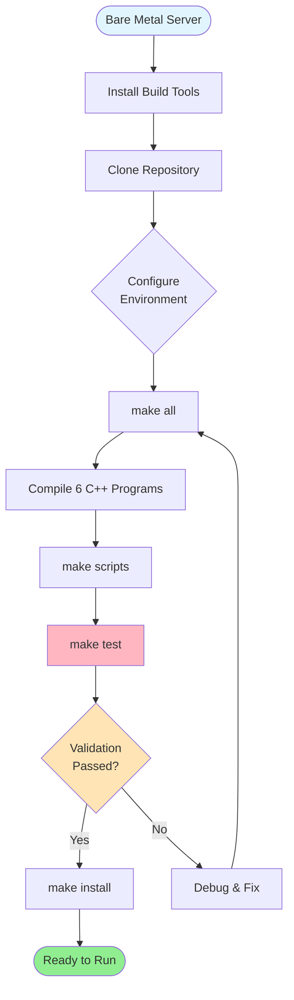
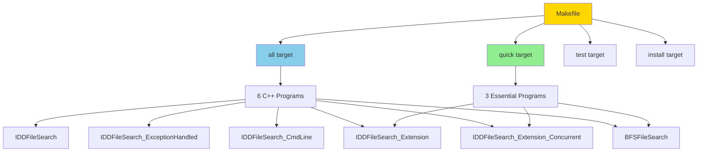
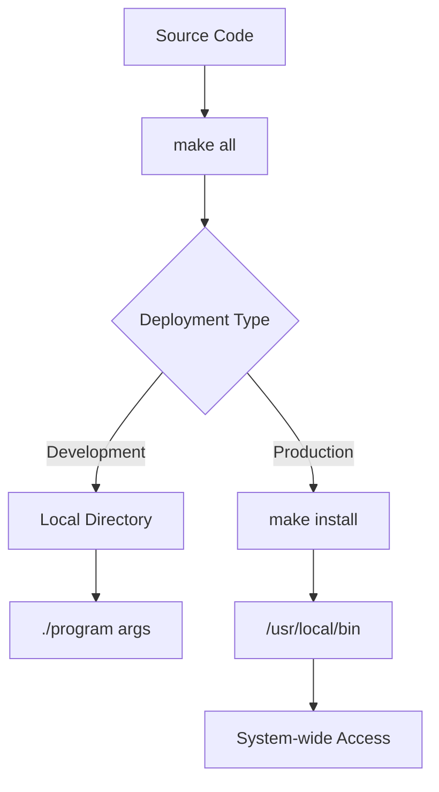

# Enterprise Document Tree Search - Build & Deployment Guide

This guide provides comprehensive information for bare-metal setup, compilation, installation, testing, and deployment of the file search algorithm implementations.

## Quick Start

```bash
# Clone and build
git clone https://github.com/danindiana/enterprise-document-treesearch.git
cd enterprise-document-treesearch
make all

# Smoke test
make test

# Install system-wide (optional)
sudo make install
```

## Table of Contents

- [Build Pipeline Overview](#build-pipeline-overview)
- [Bare Metal Setup](#bare-metal-setup)
- [Compilation](#compilation)
- [Smoke Testing](#smoke-testing)
- [Installation & Deployment](#installation--deployment)
- [CI/CD Environment](#cicd-environment)
- [Troubleshooting](#troubleshooting)
- [Dependencies](#dependencies)

## Build Pipeline Overview



## Bare Metal Setup

### System Requirements

**Minimum Requirements:**
- **OS**: Linux (Ubuntu 20.04+, Debian 10+, RHEL 8+, CentOS 8+)
- **CPU**: x86_64 or ARM64 with multi-core support (for the concurrent version)
- **RAM**: 256 MB minimum (1 GB recommended)
- **Disk**: 50 MB for binaries + storage for search operations
- **Compiler**: GCC 9.0+ or Clang 9.0+ (supporting C++17 `<filesystem>` natively)
- **Build Tools**: GNU Make 4.0+

**Tested Environments:**
- Ubuntu 22.04 LTS with GCC 13.3.0 (verified via GitHub Actions CI)
- Debian 11 with GCC 10.2.1 <!-- TODO: VERIFY -->
- RHEL 9 with GCC 11.3.1 <!-- TODO: VERIFY -->

### Step 1: Install Build Dependencies

#### Ubuntu/Debian
```bash
sudo apt-get update
sudo apt-get install -y \
    build-essential \
    g++ \
    make \
    git

# Verify installation
g++ --version    # Should show C++17 support
make --version   # Should show 4.0 or higher
```

#### RHEL/CentOS/Fedora
```bash
sudo dnf groupinstall "Development Tools"
sudo dnf install -y gcc-c++ make git

# Verify installation
g++ --version
make --version
```

#### Alpine Linux
```bash
apk add --no-cache \
    g++ \
    make \
    git \
    libc-dev
```

### Step 2: Clone Repository

```bash
git clone https://github.com/danindiana/enterprise-document-treesearch.git
cd enterprise-document-treesearch
```

## Compilation

### Build System Architecture



### Build Targets

| Target | Description | Use Case |
|---|---|---|
| `make all` | Build all 6 C++ implementations | Full deployment |
| `make quick` | Build 3 core versions (Extension, Extension_Concurrent, BFSFileSearch) | Fast deployment |
| `make clean` | Remove all compiled binaries and temporary artifacts | Clean rebuild |
| `make test` | Compile and run basic validation tests | Verification |
| `make scripts` | Make utility shell scripts executable | Script setup |
| `make install` | Install executables to `/usr/local/bin` (requires sudo) | System-wide install |
| `make uninstall`| Remove executables from `/usr/local/bin` (requires sudo) | Cleanup |
| `make chapel` | Compile the optional Chapel implementation (requires `chpl`) | Chapel deployment |
| `make help` | Show help information | Documentation |

### Full Build Process

```bash
# Clean any existing artifacts
make clean

# Build all C++ programs
make all
```

### Quick Build (Core Algorithms)

```bash
make quick

# Builds only:
# - IDDFileSearch_Extension (extension-based sequential search)
# - IDDFileSearch_Extension_Concurrent (multi-threaded extension-based search)
# - BFSFileSearch (breadth-first traversal alternative)
```

### Compiler Flags

```makefile
CXX = g++
CXXFLAGS = -std=c++17 -Wall -Wextra -O2
THREAD_FLAGS = -pthread  # For concurrent version
```

**Flag Breakdown:**
- `-std=c++17`: Enable C++17 standard features (specifically `<filesystem>`)
- `-Wall -Wextra`: Enable all standard warnings for code quality
- `-O2`: Optimization level 2
- `-pthread`: POSIX threads support (required for parallel traversal)

## Smoke Testing

### Automated Smoke Test

```bash
make test
```

**Expected Output:**
```
Testing IDDFileSearch_Extension...
✓ IDDFileSearch_Extension OK
Testing BFSFileSearch...
✓ BFSFileSearch OK
```

### Manual Smoke Test Suite

#### Test 1: Verify Binaries Execute

```bash
# Test all programs show usage messages
for prog in IDDFileSearch IDDFileSearch_ExceptionHandled \
            IDDFileSearch_CmdLine IDDFileSearch_Extension \
            IDDFileSearch_Extension_Concurrent BFSFileSearch; do
    echo "Testing $prog..."
    ./$prog 2>&1 | grep -q "Usage:" && echo "✓ PASS" || echo "✗ FAIL"
done
```

#### Test 2: Functional Search Test

```bash
# Create test directory structure
mkdir -p /tmp/smoke_test/level1/level2
touch /tmp/smoke_test/test.txt
touch /tmp/smoke_test/test.pdf
touch /tmp/smoke_test/level1/document.pdf
touch /tmp/smoke_test/level1/level2/deep.pdf

# Test extension search
./IDDFileSearch_Extension .pdf /tmp/smoke_test 3

# Expected: Should find 3 PDF files
# Found file: /tmp/smoke_test/test.pdf
# Found file: /tmp/smoke_test/level1/document.pdf
# Found file: /tmp/smoke_test/level1/level2/deep.pdf

# Cleanup
rm -rf /tmp/smoke_test
```

#### Test 3: Concurrent Performance Test

```bash
# Create large test directory
mkdir -p /tmp/perf_test/{a,b,c,d,e}/{1,2,3,4,5}
for dir in /tmp/perf_test/*/; do
    touch "$dir/test.log"
done

# Test concurrent search
time ./IDDFileSearch_Extension_Concurrent .log /tmp/perf_test 3

# Cleanup
rm -rf /tmp/perf_test
```

#### Test 4: Error Handling Test

```bash
# Test with invalid path
./IDDFileSearch_Extension .txt /nonexistent/path 5
# Should handle gracefully without crashing

# Test with permission denied (requires root to create)
sudo mkdir -p /tmp/restricted
sudo chmod 000 /tmp/restricted
./IDDFileSearch_Extension .txt /tmp 2
# Should skip restricted directory gracefully and continue
sudo rm -rf /tmp/restricted
```

### Smoke Test Validation Checklist

- [ ] All 6 C++ binaries compile without errors
- [ ] Usage messages display correctly for all programs
- [ ] Can search and find files by extension
- [ ] Concurrent version executes without thread errors
- [ ] BFS alternative algorithm works correctly
- [ ] Error handling works for invalid paths
- [ ] Permission denied errors handled gracefully
- [ ] Shell scripts are executable
- [ ] Interactive disk selection works (`./robustDiskSelectSearch.sh`)

## Installation & Deployment

### Development Installation

```bash
# Build in current directory
make all
make scripts

# Run from current directory
./IDDFileSearch_Extension .pdf /path/to/search 5
```

### System-Wide Installation

```bash
# Install to /usr/local/bin (requires sudo)
sudo make install

# Verify installation
which IDDFileSearch_Extension
# Should output: /usr/local/bin/IDDFileSearch_Extension

# Run from anywhere
IDDFileSearch_Extension .pdf /home/$USER 10
```

### Uninstallation

```bash
sudo make uninstall
```

### Deployment Architecture



## CI/CD Environment

### Automated GitHub Actions CI
The project uses GitHub Actions for continuous integration. The workflow compiles all programs using `g++` and GNU Make, runs automated smoke tests, and verifies extension searching behavior.

See the workflow file in `.github/workflows/build-test.yml`.

### Container-Based Deployment

#### Dockerfile Example

```dockerfile
FROM gcc:13 AS builder
WORKDIR /build
COPY . .
RUN make all

FROM ubuntu:22.04
COPY --from=builder /build/IDDFileSearch* /usr/local/bin/
COPY --from=builder /build/BFSFileSearch /usr/local/bin/
ENTRYPOINT ["/usr/local/bin/IDDFileSearch_Extension"]
```

**Build and run:**
```bash
docker build -t tree-search:latest .
docker run tree-search:latest .pdf /data 10
```

## Troubleshooting

### Common Build Issues

#### Issue: C++17 Not Supported
**Symptom:**
```
error: #error This file requires compiler and library support for the ISO C++ 2017 standard.
```
**Solution:**
Ensure you are using a compiler supporting C++17 (GCC 9+ or Clang 9+). Export the compiler flag if necessary:
```bash
export CXX=g++-11
make clean && make all
```

#### Issue: pthread Linking Error
**Symptom:**
```
undefined reference to `pthread_create'
```
**Solution:**
Verify that `-pthread` is passed during compilation. The Makefile does this automatically for `IDDFileSearch_Extension_Concurrent`.

#### Issue: Filesystem Not Found
**Symptom:**
```
fatal error: filesystem: No such file or directory
```
**Solution:**
Upgrade GCC or Clang to a modern version supporting standard `<filesystem>`. On older platforms, you may need to use `g++-8` or earlier and link explicitly with `-lstdc++fs`.

#### Issue: Permission Denied During Search
**Symptom:**
```
filesystem error: cannot access: Permission denied
```
**Solution:**
This is caught and handled gracefully in the exception-safe versions (all implementations except the raw `IDDFileSearch.cpp`). For searching system directories, run with `sudo`.
