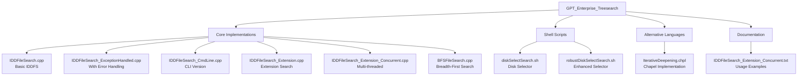
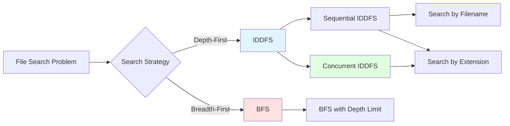
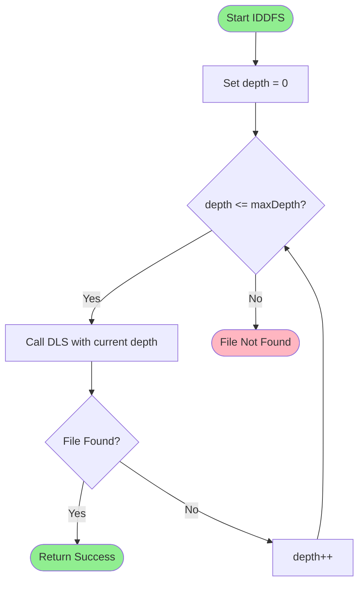
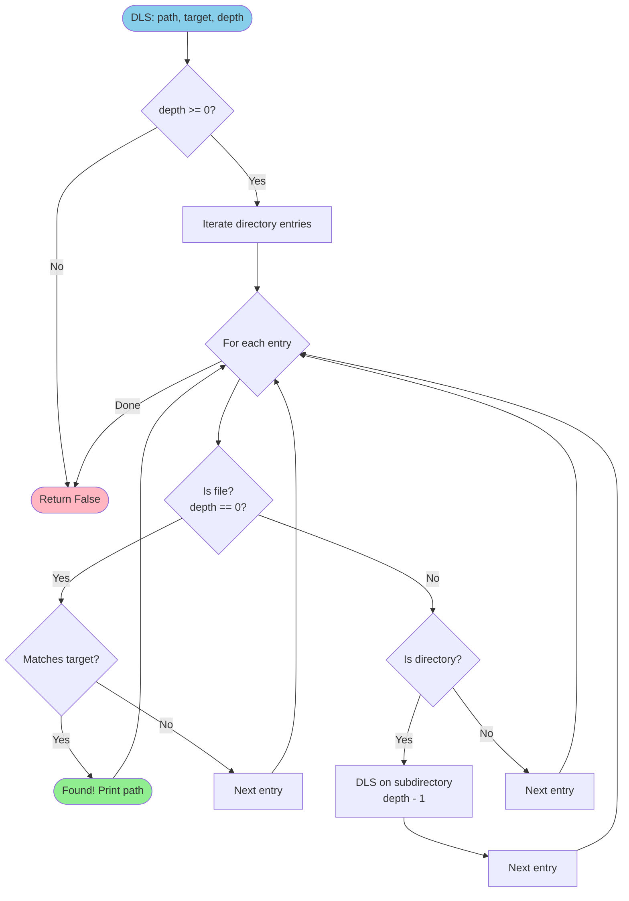
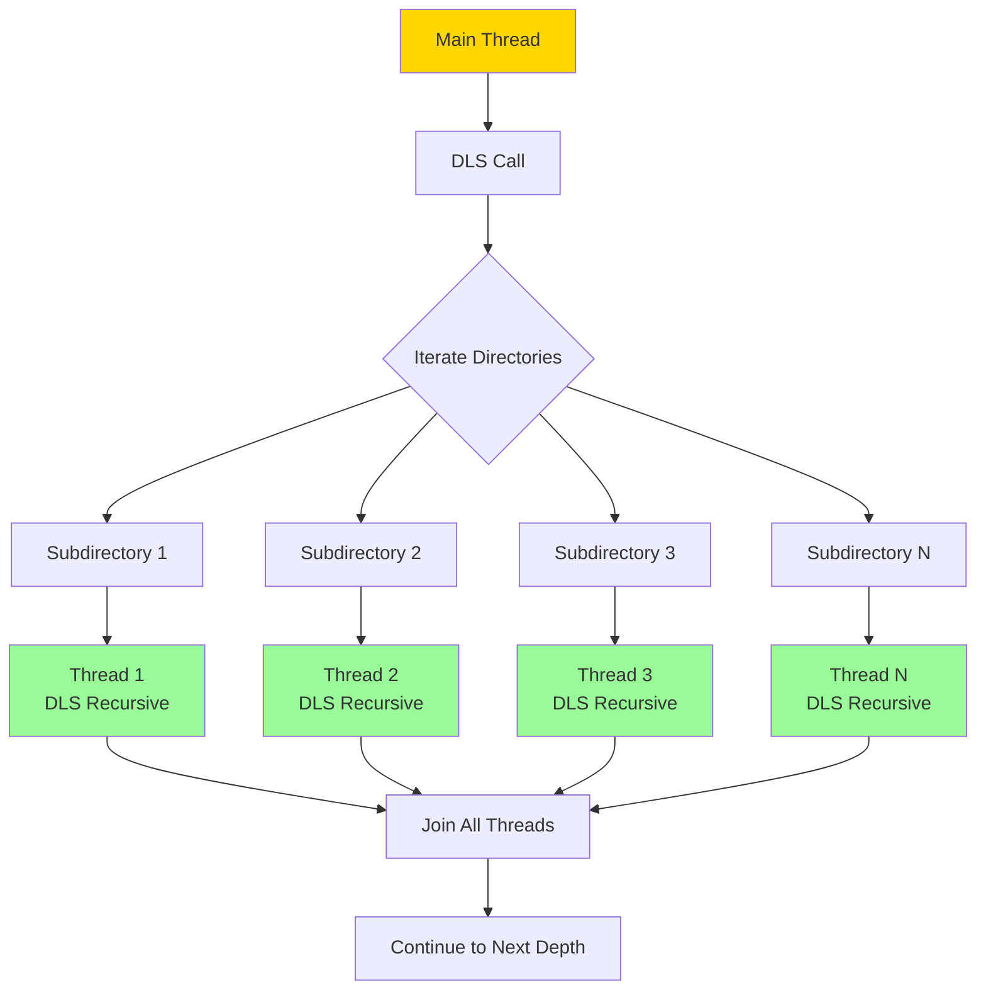
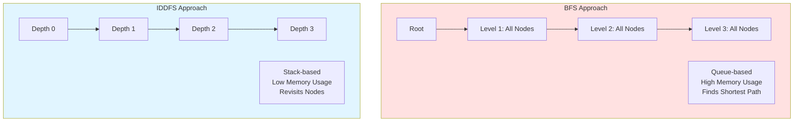
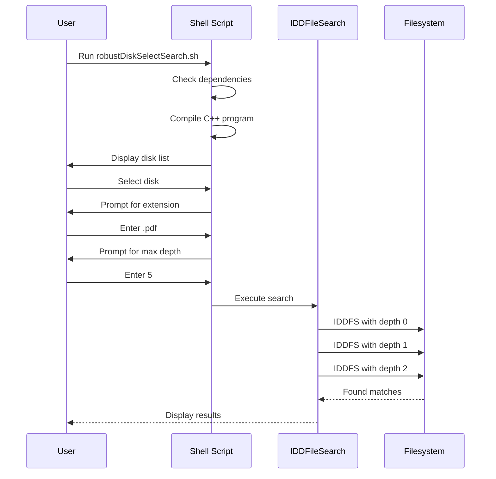
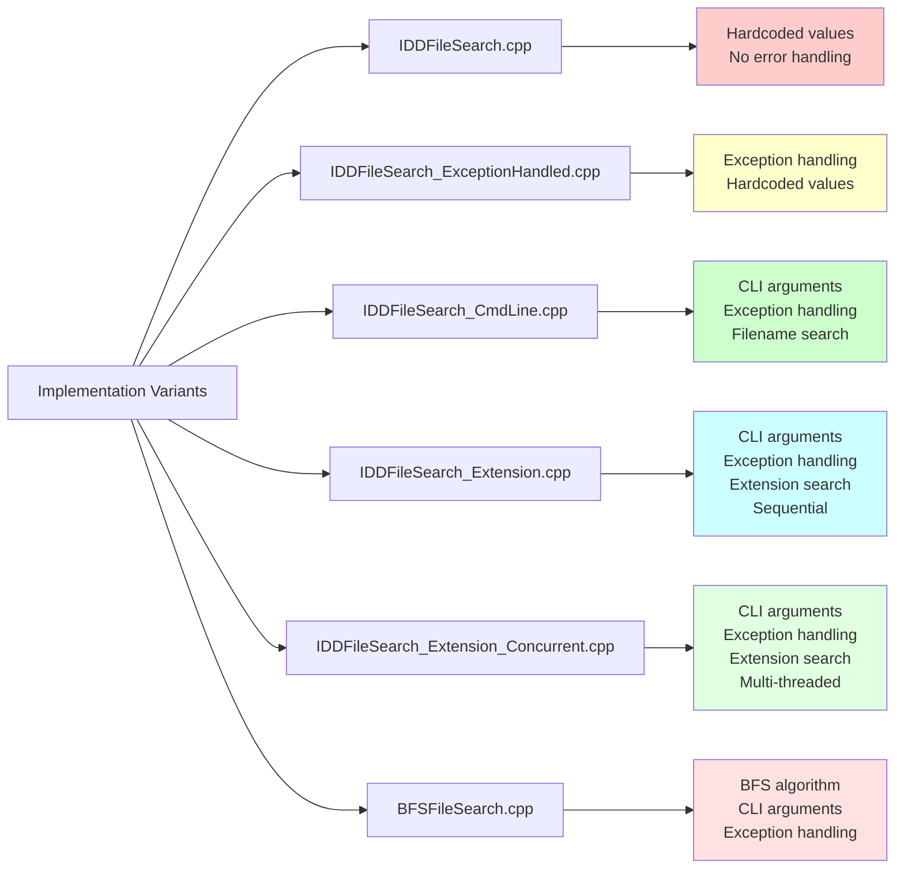
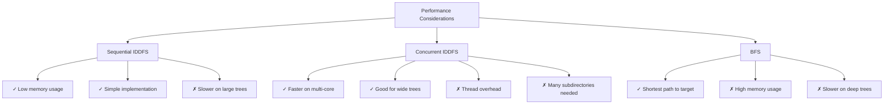

# GPT Enterprise Tree Search

A comprehensive file search toolkit implementing advanced tree search algorithms with various optimization strategies for enterprise-scale file systems.

## Overview

This repository contains multiple implementations of file search algorithms designed for efficient file discovery across large filesystems, including mounted disks and external storage devices.

## Repository Structure



## Algorithm Architecture



## IDDFS Algorithm Flow



## DLS (Depth-Limited Search) Flow



## Concurrent IDDFS Architecture



## BFS vs IDDFS Comparison



## Usage Workflow



## Implementation Comparison



## Features

### Core Algorithms

1. **IDDFS (Iterative Deepening Depth-First Search)**
   - Memory-efficient tree traversal
   - Configurable maximum search depth
   - Multiple variants with progressive enhancements

2. **BFS (Breadth-First Search)**
   - Level-by-level traversal
   - Queue-based implementation
   - Optimal for finding closest matches

### Implementation Variants

| File | Features | Use Case |
|------|----------|----------|
| `IDDFileSearch.cpp` | Basic IDDFS | Learning/Testing |
| `IDDFileSearch_ExceptionHandled.cpp` | Error handling | Production (basic) |
| `IDDFileSearch_CmdLine.cpp` | CLI arguments | Flexible usage |
| `IDDFileSearch_Extension.cpp` | Extension-based search | Finding files by type |
| `IDDFileSearch_Extension_Concurrent.cpp` | Multi-threaded | Large filesystem search |
| `BFSFileSearch.cpp` | Breadth-first approach | Alternative strategy |

## Compilation

### C++ Programs

```bash
# Standard compilation
g++ -std=c++17 IDDFileSearch_Extension.cpp -o IDDFileSearch_Extension

# Concurrent version (requires pthread)
g++ -std=c++17 -pthread IDDFileSearch_Extension_Concurrent.cpp -o IDDFileSearch_Extension_Concurrent

# BFS version
g++ -std=c++17 BFSFileSearch.cpp -o BFSFileSearch
```

### Chapel Program

```bash
chpl IterativeDeepening.chpl
```

## Usage Examples

### Using Shell Scripts (Recommended)

```bash
# Interactive disk selection with robust error checking
./robustDiskSelectSearch.sh

# Simple disk selection
./diskSelectSearch.sh
```

### Direct Command Line Usage

```bash
# Search for PDF files
./IDDFileSearch_Extension .pdf /path/to/search 5

# Search for text files with concurrent search
./IDDFileSearch_Extension_Concurrent .txt /media/disk 8

# BFS search for JPEG files
./BFSFileSearch /path/to/search target.jpg 10
```

### Usage Patterns

```bash
# Syntax
./IDDFileSearch_Extension [extension] [root_path] [max_depth]

# Examples from real usage
sudo ./IDDFileSearch_Extension .pdf /media/walter/7514e32b-65c9-4a64-a233-5db2311455f4/files/ 3
sudo ./IDDFileSearch_Extension .jpg /media/walter/462C364D2C3637EF/ 8
```

## Performance Characteristics



## Algorithm Complexity

| Algorithm | Time Complexity | Space Complexity | Best For |
|-----------|----------------|------------------|----------|
| IDDFS (Sequential) | O(b^d) | O(d) | Deep, narrow trees |
| IDDFS (Concurrent) | O(b^d / p) | O(d * p) | Wide trees, multi-core |
| BFS | O(b^d) | O(b^d) | Shallow searches |

Where:
- `b` = branching factor (avg. subdirectories per directory)
- `d` = depth of solution
- `p` = number of processor cores

## Error Handling

All modern implementations include:
- Exception handling for filesystem errors
- Permission denied handling
- Invalid path handling
- Graceful degradation

## Dependencies

- C++17 or later
- Standard library `<filesystem>` support
- `<thread>` support for concurrent versions
- POSIX-compliant shell for scripts
- `lsblk`, `grep`, `awk` for shell scripts

## Suggested Improvements

### Structural Organization

Consider reorganizing the repository:

```
GPT_Enterprise_Treesearch/
├── README.md
├── LICENSE
├── Makefile
├── .gitignore
├── src/
│   ├── basic/
│   │   ├── IDDFileSearch.cpp
│   │   └── IDDFileSearch_ExceptionHandled.cpp
│   ├── advanced/
│   │   ├── IDDFileSearch_Extension.cpp
│   │   └── IDDFileSearch_Extension_Concurrent.cpp
│   └── algorithms/
│       └── BFSFileSearch.cpp
├── scripts/
│   ├── diskSelectSearch.sh
│   └── robustDiskSelectSearch.sh
├── chapel/
│   └── IterativeDeepening.chpl
├── docs/
│   └── usage_examples.md
└── bin/
    └── (compiled binaries)
```

### Additional Enhancements

1. **Add Makefile** for easier compilation
2. **Add .gitignore** to exclude binaries
3. **Performance benchmarking** suite
4. **Unit tests** for core functions
5. **Progress indicators** for long searches
6. **Result logging** to file
7. **Pattern matching** beyond extensions
8. **Symbolic link handling** options

## Contributing

When contributing, please:
1. Maintain C++17 compatibility
2. Include error handling
3. Document command-line arguments
4. Add usage examples
5. Update this README

## License

See LICENSE file for details.

## Future Work

- [ ] Implement result caching
- [ ] Add regex pattern support
- [ ] Create Python bindings
- [ ] Add progress bars
- [ ] Implement parallel BFS
- [ ] Add file content searching
- [ ] Create GUI wrapper
- [ ] Performance benchmarking suite
