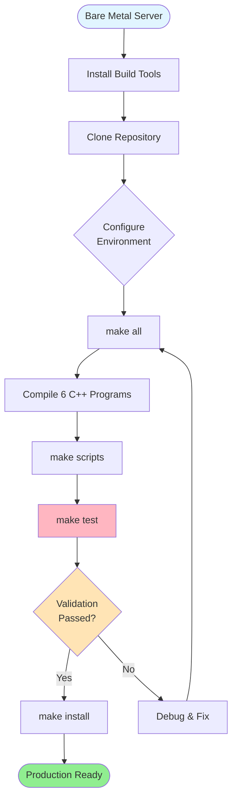
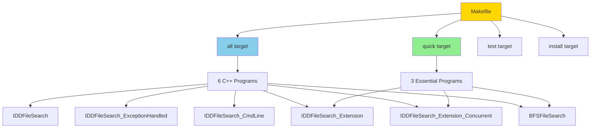
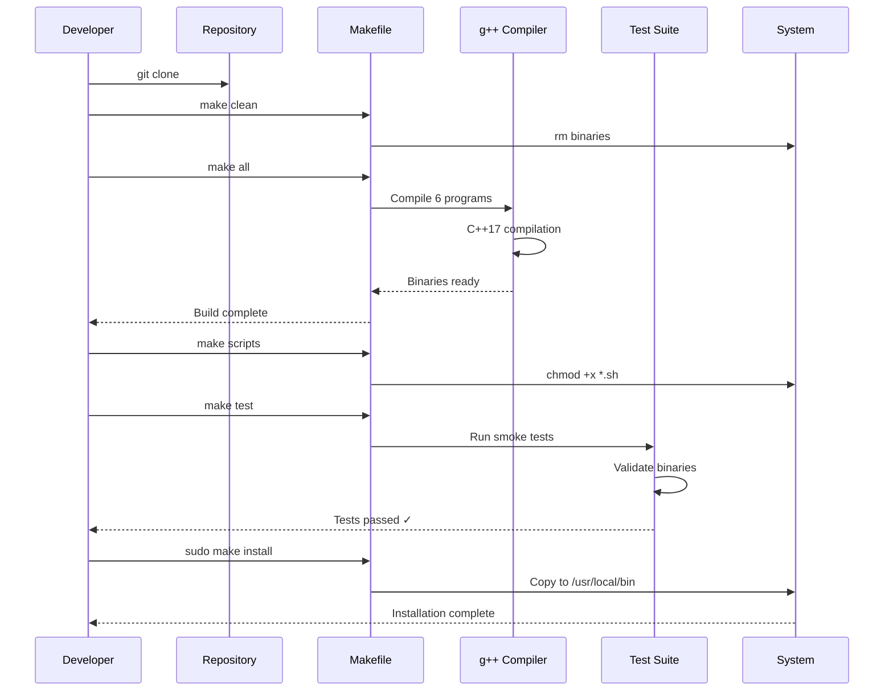

# GPT Enterprise Tree Search - Build & Deployment Guide

A production-ready file search toolkit with comprehensive build pipeline documentation for bare metal deployment and smoke testing.

## Quick Start

```bash
# Clone and build
git clone <repository-url>
cd GPT_Enterprise_Treesearch
make all

# Smoke test
make test

# Install system-wide (optional)
sudo make install
```

## Table of Contents

- [Build Pipeline Overview](#build-pipeline-overview)
- [Bare Metal Setup](#bare-metal-setup)
- [Compilation](#compilation)
- [Smoke Testing](#smoke-testing)
- [Installation & Deployment](#installation--deployment)
- [CI/CD Environment](#cicd-environment)
- [Troubleshooting](#troubleshooting)
- [Dependencies](#dependencies)

## Build Pipeline Overview



## Bare Metal Setup

### System Requirements

**Minimum Requirements:**
- **OS**: Linux (Ubuntu 20.04+, Debian 10+, RHEL 8+, CentOS 8+)
- **CPU**: x86_64 or ARM64 with multi-core support (for concurrent versions)
- **RAM**: 256 MB minimum (1 GB recommended)
- **Disk**: 50 MB for binaries + storage for search operations
- **Compiler**: GCC 7.0+ or Clang 5.0+
- **Build Tools**: GNU Make 4.0+

**Tested Environments:**
- Ubuntu 22.04 LTS with GCC 13.3.0
- Debian 11 with GCC 10.2.1
- RHEL 9 with GCC 11.3.1

### Step 1: Install Build Dependencies

#### Ubuntu/Debian
```bash
sudo apt-get update
sudo apt-get install -y \
    build-essential \
    g++ \
    make \
    git

# Verify installation
g++ --version    # Should show 7.0 or higher
make --version   # Should show 4.0 or higher
```

#### RHEL/CentOS/Fedora
```bash
sudo dnf groupinstall "Development Tools"
sudo dnf install -y gcc-c++ make git

# Verify installation
g++ --version
make --version
```

#### Alpine Linux
```bash
apk add --no-cache \
    g++ \
    make \
    git \
    libc-dev
```

### Step 2: Clone Repository

```bash
git clone https://github.com/danindiana/GPT_Enterprise_Treesearch.git
cd GPT_Enterprise_Treesearch
```

### Step 3: Verify C++17 Support

```bash
# Test C++17 filesystem support
cat > /tmp/test_cpp17.cpp << 'EOF'
#include <filesystem>
#include <iostream>
int main() {
    std::cout << "C++17 supported" << std::endl;
    return 0;
}
EOF

g++ -std=c++17 /tmp/test_cpp17.cpp -o /tmp/test_cpp17
/tmp/test_cpp17
# Should output: C++17 supported
```

## Compilation

### Build System Architecture



### Build Targets

| Target | Description | Use Case |
|--------|-------------|----------|
| `make all` | Build all 6 implementations | Full deployment |
| `make quick` | Build 3 production versions | Fast deployment |
| `make clean` | Remove all binaries | Clean rebuild |
| `make test` | Run smoke tests | Validation |
| `make scripts` | Make shell scripts executable | Script deployment |
| `make install` | Install to /usr/local/bin | System-wide install |
| `make uninstall` | Remove from system | Cleanup |
| `make help` | Show help information | Documentation |

### Full Build Process

```bash
# Clean any existing artifacts
make clean

# Build all programs
make all

# Expected output:
# Compiling IDDFileSearch...
# Compiling IDDFileSearch_ExceptionHandled...
# Compiling IDDFileSearch_CmdLine...
# Compiling IDDFileSearch_Extension...
# Compiling IDDFileSearch_Extension_Concurrent...
# Compiling BFSFileSearch...
# Build complete! All programs compiled successfully.
```

### Quick Build (Production Essentials)

```bash
make quick

# Builds only:
# - IDDFileSearch_Extension (extension-based search)
# - IDDFileSearch_Extension_Concurrent (multi-threaded)
# - BFSFileSearch (breadth-first alternative)
```

### Compiler Flags

```makefile
CXX = g++
CXXFLAGS = -std=c++17 -Wall -Wextra -O2
THREAD_FLAGS = -pthread  # For concurrent version
```

**Flag Breakdown:**
- `-std=c++17`: Enable C++17 standard features
- `-Wall -Wextra`: Enable all warnings for code quality
- `-O2`: Optimization level 2 (balance speed/size)
- `-pthread`: POSIX threads support (concurrent version only)

## Smoke Testing

### Automated Smoke Test

```bash
make test
```

**Expected Output:**
```
Testing IDDFileSearch_Extension...
✓ IDDFileSearch_Extension OK
Testing BFSFileSearch...
✓ BFSFileSearch OK
All tests passed!
```

### Manual Smoke Test Suite

#### Test 1: Verify Binaries Execute

```bash
# Test all programs show usage messages
for prog in IDDFileSearch IDDFileSearch_ExceptionHandled \
            IDDFileSearch_CmdLine IDDFileSearch_Extension \
            IDDFileSearch_Extension_Concurrent BFSFileSearch; do
    echo "Testing $prog..."
    ./$prog 2>&1 | grep -q "Usage:" && echo "✓ PASS" || echo "✗ FAIL"
done
```

#### Test 2: Functional Search Test

```bash
# Create test directory structure
mkdir -p /tmp/smoke_test/level1/level2
touch /tmp/smoke_test/test.txt
touch /tmp/smoke_test/test.pdf
touch /tmp/smoke_test/level1/document.pdf
touch /tmp/smoke_test/level1/level2/deep.pdf

# Test extension search
./IDDFileSearch_Extension .pdf /tmp/smoke_test 3

# Expected: Should find 3 PDF files
# Found file: /tmp/smoke_test/test.pdf
# Found file: /tmp/smoke_test/level1/document.pdf
# Found file: /tmp/smoke_test/level1/level2/deep.pdf

# Cleanup
rm -rf /tmp/smoke_test
```

#### Test 3: Concurrent Performance Test

```bash
# Create large test directory
mkdir -p /tmp/perf_test/{a,b,c,d,e}/{1,2,3,4,5}
for dir in /tmp/perf_test/*/; do
    touch "$dir/test.log"
done

# Test concurrent search
time ./IDDFileSearch_Extension_Concurrent .log /tmp/perf_test 3

# Should find 25 files
# Cleanup
rm -rf /tmp/perf_test
```

#### Test 4: Error Handling Test

```bash
# Test with invalid path
./IDDFileSearch_Extension .txt /nonexistent/path 5
# Should handle gracefully without crashing

# Test with permission denied (requires root)
sudo mkdir -p /tmp/restricted
sudo chmod 000 /tmp/restricted
./IDDFileSearch_Extension .txt /tmp 2
# Should skip restricted directory gracefully
sudo rm -rf /tmp/restricted
```

### Smoke Test Validation Checklist

- [ ] All 6 binaries compile without errors
- [ ] All 6 binaries compile without warnings
- [ ] Usage messages display correctly for all programs
- [ ] Can search and find files by extension
- [ ] Concurrent version executes without thread errors
- [ ] BFS alternative algorithm works correctly
- [ ] Error handling works for invalid paths
- [ ] Permission denied errors handled gracefully
- [ ] Shell scripts are executable
- [ ] Interactive disk selection works (`./robustDiskSelectSearch.sh`)

## Installation & Deployment

### Development Installation

```bash
# Build in current directory
make all
make scripts

# Run from current directory
./IDDFileSearch_Extension .pdf /path/to/search 5
```

### System-Wide Installation

```bash
# Install to /usr/local/bin (requires sudo)
sudo make install

# Verify installation
which IDDFileSearch_Extension
# Should output: /usr/local/bin/IDDFileSearch_Extension

# Run from anywhere
IDDFileSearch_Extension .pdf /home 10
```

### Uninstallation

```bash
sudo make uninstall
```

### Deployment Architecture

```mermaid
graph TD
    A[Source Code] --> B[make all]
    B --> C{Deployment Type}

    C -->|Development| D[Local Directory]
    C -->|Production| E[make install]

    D --> D1[./program args]
    E --> E1[/usr/local/bin]

    E1 --> F[System-wide Access]
    F --> G1[User 1]
    F --> G2[User 2]
    F --> G3[User N]

    style A fill:#FFE4B5
    style E1 fill:#90EE90
    style F fill:#87CEEB
```

## CI/CD Environment

### Current State: Manual Build & Test

**Build Process:**
- Manual compilation via Makefile
- Manual smoke testing
- Manual installation

**No Automated CI/CD:**
- ❌ No GitHub Actions
- ❌ No GitLab CI
- ❌ No Jenkins pipelines
- ❌ No automated testing on commits
- ❌ No automated releases
- ❌ No container builds

### Recommended CI/CD Implementation

#### GitHub Actions Workflow Example

Create `.github/workflows/build-test.yml`:

```yaml
name: Build and Test

on: [push, pull_request]

jobs:
  build:
    runs-on: ubuntu-latest

    steps:
    - uses: actions/checkout@v3

    - name: Install dependencies
      run: sudo apt-get update && sudo apt-get install -y build-essential g++ make

    - name: Build all programs
      run: make all

    - name: Run smoke tests
      run: make test

    - name: Functional test
      run: |
        mkdir -p /tmp/test_ci
        touch /tmp/test_ci/test.pdf
        ./IDDFileSearch_Extension .pdf /tmp/test_ci 1 | grep -q "test.pdf"

    - name: Upload artifacts
      uses: actions/upload-artifact@v3
      with:
        name: binaries
        path: |
          IDDFileSearch*
          BFSFileSearch
```

#### GitLab CI Example

Create `.gitlab-ci.yml`:

```yaml
stages:
  - build
  - test
  - deploy

build:
  stage: build
  image: gcc:latest
  script:
    - make all
  artifacts:
    paths:
      - IDDFileSearch*
      - BFSFileSearch

test:
  stage: test
  image: gcc:latest
  script:
    - make test
  dependencies:
    - build

deploy:
  stage: deploy
  script:
    - sudo make install
  only:
    - main
  when: manual
```

### Container-Based Deployment

#### Dockerfile Example

```dockerfile
FROM gcc:13 AS builder
WORKDIR /build
COPY . .
RUN make all

FROM ubuntu:22.04
COPY --from=builder /build/IDDFileSearch* /usr/local/bin/
COPY --from=builder /build/BFSFileSearch /usr/local/bin/
ENTRYPOINT ["/usr/local/bin/IDDFileSearch_Extension"]
```

**Build and run:**
```bash
docker build -t tree-search:latest .
docker run tree-search:latest .pdf /data 10
```

## Troubleshooting

### Common Build Issues

#### Issue: C++17 Not Supported

**Symptom:**
```
error: #error This file requires compiler and library support for the ISO C++ 2017 standard.
```

**Solution:**
```bash
# Upgrade GCC
sudo apt-get install g++-11
export CXX=g++-11
make clean && make all

# Or use older experimental filesystem
g++ -std=c++17 -lstdc++fs program.cpp
```

#### Issue: pthread Linking Error

**Symptom:**
```
undefined reference to `pthread_create'
```

**Solution:**
```bash
# Ensure -pthread flag is used
g++ -std=c++17 -pthread IDDFileSearch_Extension_Concurrent.cpp -o IDDFileSearch_Extension_Concurrent
```

#### Issue: Filesystem Not Found

**Symptom:**
```
fatal error: filesystem: No such file or directory
```

**Solution:**
```bash
# Install libstdc++ development files
sudo apt-get install libstdc++-dev

# Or upgrade GCC to 8+
sudo apt-get install g++-8
```

#### Issue: Permission Denied During Search

**Symptom:**
```
filesystem error: cannot access: Permission denied
```

**Solution:**
```bash
# Run with sudo for system directories
sudo ./IDDFileSearch_Extension .pdf /media/disk 5

# Or search user-accessible directories only
./IDDFileSearch_Extension .pdf /home/$USER 10
```

### Build Validation

```bash
# Verify all binaries exist
ls -lh IDDFileSearch* BFSFileSearch

# Check binary dependencies
ldd IDDFileSearch_Extension_Concurrent
# Should show: libpthread.so, libstdc++.so, libc.so

# Test execution on known directory
./IDDFileSearch_Extension .md . 2
# Should find README.md and other markdown files
```

### Performance Troubleshooting

#### Slow Compilation

```bash
# Use parallel make (4 cores)
make -j4 all
```

#### Slow Search Performance

```bash
# Use concurrent version for large filesystems
./IDDFileSearch_Extension_Concurrent .pdf /large/filesystem 10

# Limit search depth to reduce traversal
./IDDFileSearch_Extension .pdf /large/filesystem 5  # Instead of 10
```

## Dependencies

### Runtime Dependencies

**Core Requirements:**
- Linux kernel 3.10+ (for filesystem features)
- glibc 2.17+ or musl libc
- libstdc++ with C++17 support
- libpthread (for concurrent version)

**Shell Script Dependencies:**
- Bash 4.0+
- `lsblk` (from util-linux)
- `grep` (GNU grep)
- `awk` (GNU awk or mawk)

**No External Libraries Required:**
- All functionality uses C++ standard library
- No third-party dependencies
- Self-contained executables

### Build-Time Dependencies

```bash
# Debian/Ubuntu
sudo apt-get install \
    build-essential \
    g++ \
    make \
    git

# RHEL/CentOS/Fedora
sudo dnf install \
    gcc-c++ \
    make \
    git

# Alpine
apk add \
    g++ \
    make \
    git \
    libc-dev
```

### Optional Dependencies

**Chapel Compiler** (for IterativeDeepening.chpl):
```bash
# Chapel is optional and not required for core functionality
wget https://github.com/chapel-lang/chapel/releases/download/1.32.0/chapel-1.32.0.tar.gz
tar xzf chapel-1.32.0.tar.gz
cd chapel-1.32.0
make
source util/setchplenv.bash

# Build Chapel version
make chapel
```

## Repository Structure

```
GPT_Enterprise_Treesearch/
├── README.md                              # This file (build/deployment focus)
├── Makefile                               # Build system
├── .gitignore                             # Git ignore rules
├── src/                                   # C++ source files
│   ├── IDDFileSearch.cpp
│   ├── IDDFileSearch_ExceptionHandled.cpp
│   ├── IDDFileSearch_CmdLine.cpp
│   ├── IDDFileSearch_Extension.cpp
│   ├── IDDFileSearch_Extension_Concurrent.cpp
│   └── BFSFileSearch.cpp
├── scripts/                               # Shell scripts
│   ├── diskSelectSearch.sh
│   └── robustDiskSelectSearch.sh
├── chapel/                                # Chapel implementation
│   └── IterativeDeepening.chpl
└── docs/                                  # Documentation
    ├── ARCHITECTURE.md                    # Algorithm details
    ├── CONTRIBUTING.md                    # Contribution guide
    └── archive/                           # Archived documentation
        └── README_*.md                    # Previous README versions
```

## Build Workflow Diagram



## Production Deployment Checklist

### Pre-Deployment
- [ ] Verify system meets minimum requirements
- [ ] Install build dependencies
- [ ] Clone repository from stable branch/tag
- [ ] Review and audit source code

### Build Phase
- [ ] Run `make clean` to ensure clean build
- [ ] Run `make all` or `make quick`
- [ ] Verify no compilation errors or warnings
- [ ] Check all expected binaries exist

### Testing Phase
- [ ] Run `make test` automated smoke tests
- [ ] Execute manual functional tests
- [ ] Test concurrent version for thread safety
- [ ] Verify error handling with invalid inputs
- [ ] Test on representative filesystem structures

### Deployment Phase
- [ ] Run `sudo make install` for system-wide deployment
- [ ] Verify binaries in /usr/local/bin
- [ ] Test execution from any directory
- [ ] Configure file permissions if needed
- [ ] Update system documentation

### Post-Deployment
- [ ] Run production smoke test
- [ ] Monitor performance and resource usage
- [ ] Set up logging if required
- [ ] Document deployment date and version
- [ ] Plan rollback procedure if needed

## Support & Documentation

### Additional Documentation

- **Algorithm Details**: See `docs/ARCHITECTURE.md`
- **Contributing**: See `CONTRIBUTING.md`
- **Usage Examples**: See `docs/archive/README_*.md`

### Getting Help

- **Issues**: https://github.com/danindiana/GPT_Enterprise_Treesearch/issues
- **Discussions**: https://github.com/danindiana/GPT_Enterprise_Treesearch/discussions

## License

See LICENSE file for details.

## Version History

- **v1.0.0** - Initial release with Makefile build system
- **Current** - Build and deployment documentation
