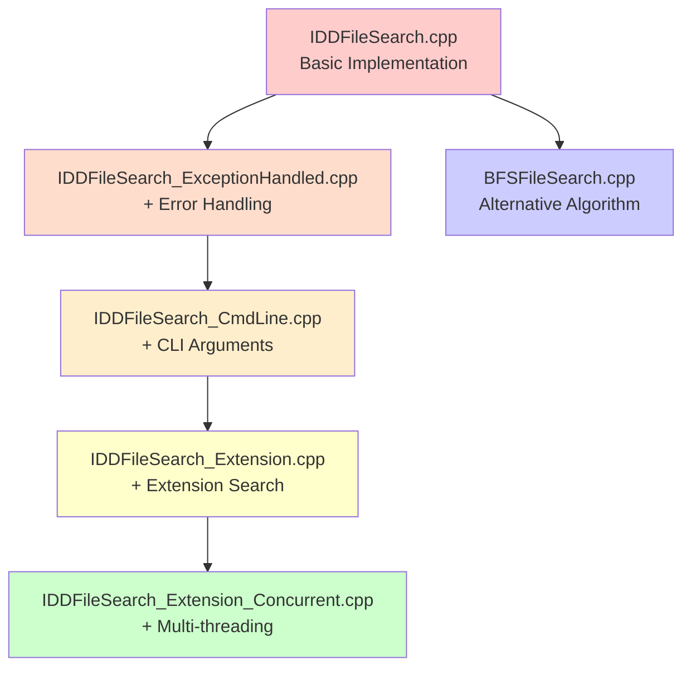
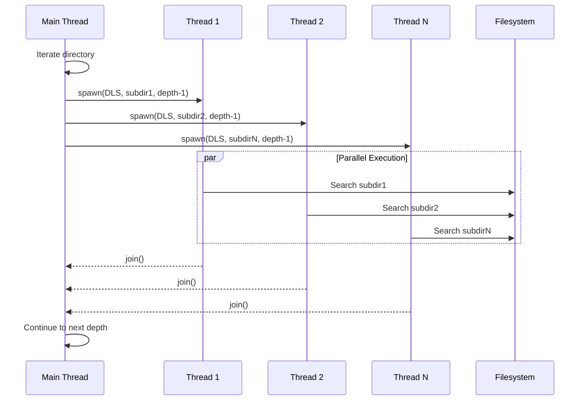
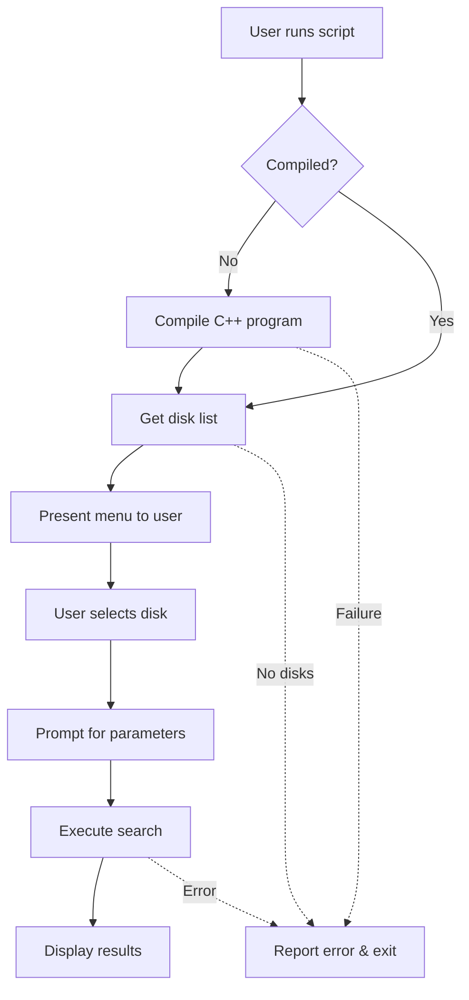
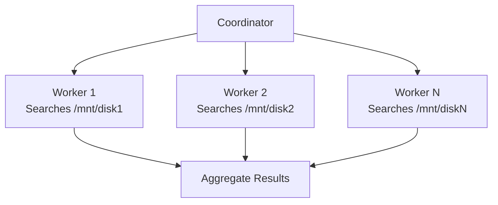

# Architecture Documentation

## Overview

This document provides detailed architectural information about the GPT Enterprise Tree Search implementation.

## Core Algorithms

### 1. Iterative Deepening Depth-First Search (IDDFS)

IDDFS combines the space efficiency of depth-first search with the optimality of breadth-first search.

#### Algorithm Description

```
IDDFS(root, target, maxDepth):
    for depth from 0 to maxDepth:
        if DLS(root, target, depth):
            return SUCCESS
    return FAILURE

DLS(node, target, depth):
    if depth == 0 and node == target:
        return SUCCESS
    if depth > 0:
        for each child of node:
            if DLS(child, target, depth - 1):
                return SUCCESS
    return FAILURE
```

#### Characteristics

- **Time Complexity**: O(b^d) where b is branching factor, d is depth
- **Space Complexity**: O(d) - only stores path from root to current node
- **Completeness**: Yes, if depth limit is sufficient
- **Optimality**: Yes, finds shallowest solution

#### Trade-offs

**Advantages:**
- Memory efficient
- Finds optimal depth solution
- Avoids getting trapped in infinite branches

**Disadvantages:**
- Revisits nodes multiple times
- Can be slow for deep solutions
- Overhead from repeated traversals

### 2. Breadth-First Search (BFS)

BFS explores all nodes at depth d before exploring nodes at depth d+1.

#### Algorithm Description

```
BFS(root, target, maxDepth):
    queue = new Queue()
    queue.enqueue((root, 0))

    while queue is not empty:
        (node, depth) = queue.dequeue()

        if node == target:
            return SUCCESS

        if depth < maxDepth:
            for each child of node:
                queue.enqueue((child, depth + 1))

    return FAILURE
```

#### Characteristics

- **Time Complexity**: O(b^d)
- **Space Complexity**: O(b^d) - stores all nodes at current level
- **Completeness**: Yes
- **Optimality**: Yes, finds shortest path

## Implementation Variants

### Evolution of Implementations



### Comparison Matrix

| Feature | Basic | Exception | CmdLine | Extension | Concurrent | BFS |
|---------|-------|-----------|---------|-----------|------------|-----|
| Error Handling | ❌ | ✅ | ✅ | ✅ | ✅ | ✅ |
| CLI Arguments | ❌ | ❌ | ✅ | ✅ | ✅ | ✅ |
| Extension Search | ❌ | ❌ | ❌ | ✅ | ✅ | ❌ |
| Multi-threaded | ❌ | ❌ | ❌ | ❌ | ✅ | ❌ |
| Algorithm | IDDFS | IDDFS | IDDFS | IDDFS | IDDFS | BFS |

## Multi-threading Architecture

### Concurrent IDDFS Design

The concurrent implementation creates a new thread for each subdirectory at each depth level.



### Thread Synchronization

```cpp
void DLS(const std::filesystem::path& currentPath,
         const std::string& target,
         int depth) {
    if (depth >= 0) {
        std::vector<std::thread> threads;

        // Spawn threads for subdirectories
        for (const auto& dirEntry : std::filesystem::directory_iterator(currentPath)) {
            if (dirEntry.is_directory()) {
                threads.emplace_back(DLS, dirEntry.path(), target, depth - 1);
            }
        }

        // Wait for all threads to complete
        for(auto &th : threads) {
            th.join();
        }
    }
}
```

### Thread Pool Considerations

**Current Implementation:**
- Creates new threads for each subdirectory
- Simple but can create many threads
- OS handles thread scheduling

**Future Enhancement:**
- Implement thread pool
- Limit maximum concurrent threads
- Reuse threads for multiple tasks
- Better resource management

## Filesystem Interaction

### Directory Traversal

The implementation uses C++17's `std::filesystem` library:

```cpp
#include <filesystem>

// Iterate directory entries
for (const auto& dirEntry : std::filesystem::directory_iterator(currentPath)) {
    if (dirEntry.is_directory()) {
        // Handle directory
    } else if (dirEntry.is_regular_file()) {
        // Handle file
    }
}
```

### Error Handling Patterns

```cpp
try {
    // Filesystem operations
    for (const auto& dirEntry : std::filesystem::directory_iterator(currentPath)) {
        // Process entry
    }
}
catch (const std::filesystem::filesystem_error& e) {
    // Handle errors:
    // - Permission denied
    // - Path doesn't exist
    // - I/O errors
    std::cerr << "Error accessing " << currentPath << ": " << e.what() << std::endl;
}
```

## Performance Analysis

### IDDFS Performance Profile


### Concurrent Speedup

Theoretical speedup with p processors:

```
Speedup = T(1) / T(p)

Where:
- T(1) = Time with 1 processor
- T(p) = Time with p processors

Ideal: Speedup = p
Reality: Speedup < p (due to overhead)
```

**Overhead Sources:**
- Thread creation/destruction
- Context switching
- Memory synchronization
- OS scheduling

### Benchmark Scenarios

| Directory Structure | Sequential | Concurrent | Speedup |
|---------------------|-----------|------------|---------|
| Deep, narrow (d=20, b=2) | Best | Overhead | 0.8x |
| Shallow, wide (d=5, b=100) | Slow | Best | 3.5x |
| Balanced (d=10, b=10) | Good | Better | 2.1x |

## Shell Script Integration

### Workflow Architecture



### Error Checking

The `robustDiskSelectSearch.sh` includes comprehensive error checking:

1. **Dependency Verification**: Checks for required commands
2. **Compilation Verification**: Ensures successful compilation
3. **Disk Detection**: Validates disk list is not empty
4. **Execution Verification**: Checks program exit status

## Chapel Implementation

The Chapel implementation provides a reference for parallel programming:

```chapel
proc DLS(node, depth, maxDepth): bool {
    if depth > maxDepth {
        return false;
    }

    if node is Target {
        return true;
    }

    for child in node.getChildren() {
        if DLS(child, depth + 1, maxDepth) {
            return true;
        }
    }

    return false;
}
```

Chapel's advantages:
- Built-in parallelism support
- Clean syntax
- Automatic optimization
- Task-based parallelism

## Memory Management

### Stack Usage

IDDFS maintains minimal stack usage:

```
Stack depth = search depth = d
Stack frame size ≈ 64-128 bytes (path + variables)
Total stack ≈ d × 100 bytes
```

For d=20: ~2KB stack usage

### Heap Usage

#### Sequential Implementation
- Minimal heap usage
- Only directory iterator objects
- Path strings

#### Concurrent Implementation
- Thread objects: ~8KB per thread
- Thread stacks: ~2MB per thread (default)
- For b=100 subdirectories: ~200MB overhead

## Extensibility Points

### Adding New Search Criteria

Current extension-based search can be extended to:

```cpp
struct SearchCriteria {
    std::string extension;
    uintmax_t minSize;
    uintmax_t maxSize;
    std::filesystem::file_time_type minTime;
    std::filesystem::file_time_type maxTime;
    std::regex contentPattern;
};

bool matches(const std::filesystem::directory_entry& entry,
             const SearchCriteria& criteria) {
    // Check all criteria
}
```

### Plugin Architecture

Future plugin system could support:

```cpp
class SearchPlugin {
public:
    virtual bool matches(const std::filesystem::path& path) = 0;
    virtual void onFound(const std::filesystem::path& path) = 0;
};

// User implements custom plugins
class PDFPlugin : public SearchPlugin {
    // Custom logic
};
```

## Security Considerations

### Path Traversal Prevention

Current implementation follows symlinks. Future enhancement:

```cpp
std::filesystem::directory_options options =
    std::filesystem::directory_options::skip_permission_denied |
    std::filesystem::directory_options::follow_directory_symlink;

// Or prevent symlink following:
options = std::filesystem::directory_options::skip_permission_denied;
```

### Permission Handling

All modern implementations include try-catch for permission errors:
- Gracefully handles denied access
- Continues search in accessible areas
- Reports errors without crashing

## Future Architecture Enhancements

### 1. Result Caching

```cpp
class SearchCache {
    std::unordered_map<std::filesystem::path, std::vector<std::filesystem::path>> cache;

public:
    void addResult(const std::filesystem::path& searchRoot,
                   const std::filesystem::path& foundPath);
    std::vector<std::filesystem::path> getCached(const std::filesystem::path& searchRoot);
};
```

### 2. Progress Reporting

```cpp
class ProgressReporter {
    std::atomic<size_t> filesScanned{0};
    std::atomic<size_t> directoriesScanned{0};

public:
    void update();
    void report();
};
```

### 3. Distributed Search

For network filesystems:



## Conclusion

The architecture balances:
- **Simplicity**: Easy to understand and modify
- **Efficiency**: Memory-efficient algorithms
- **Performance**: Optional multi-threading
- **Robustness**: Comprehensive error handling
- **Extensibility**: Clear points for enhancement
